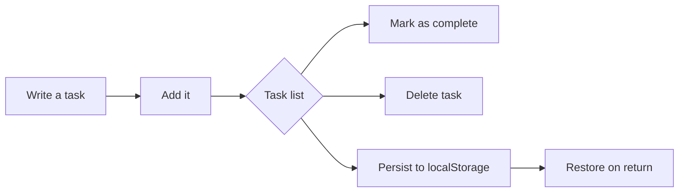

# ✅ My Tasks

> A minimal, fast, and persistent todo list to organize your day, one task at a time.

<p align="center">
  
  
  
  
</p>

## 🌟 Overview

**My Tasks** is a focused todo list application built around the essentials: write a task, add it, mark it as complete, and remove it when it is no longer needed. Everything is saved automatically in the browser, so the app does not require an account, database, or backend.

## 👀 User experience



The interface communicates its state at a glance:

| State | Behavior |
| --- | --- |
| Empty list | Shows an inviting empty state that encourages creating the first task. |
| Pending tasks | Displays each task with an action to complete it. |
| Completed task | Changes the indicator to indigo and strikes through the text. |
| Persisted list | Keeps the information on the current device. |

## ✨ Features

- **Create tasks** from an accessible form with whitespace-only input validation.
- **Complete and reopen tasks** with a circular control and `aria-pressed` state.
- **Delete tasks** individually.
- **Progress counter** showing completed tasks against the total.
- **Local persistence** through `localStorage` using the `mbs-todo-list` key.
- **Error-tolerant recovery**: corrupted data or blocked `localStorage` does not break the app.
- **Responsive design** for small and large screens.
- **Visible focus states**, screen-reader labels, and accessible button names.
- **Spanish-language interface** with a clean presentation focused on the current task.

## 🧱 Stack

| Layer | Technology |
| --- | --- |
| Framework | [Next.js 16](https://nextjs.org/) with App Router |
| UI | [React 19](https://react.dev/) |
| Language | [TypeScript](https://www.typescriptlang.org/) |
| Styling | [Tailwind CSS 4](https://tailwindcss.com/) |
| Persistence | `window.localStorage` |
| Quality checks | ESLint |
| Package manager | npm |

## 🚀 Quick start

### Requirements

- Node.js compatible with Next.js 16.
- npm.

### Installation

```bash
git clone https://github.com/brytekatze/mbs-codex-todo-app.git
cd mbs-codex-todo-app
npm install
```

### Development

```bash
npm run dev
```

Open [http://localhost:3000](http://localhost:3000) in your browser. Changes in `app/` are reflected automatically during development.

### Validation and production

```bash
# Run the linter
npm run lint

# Create the production build
npm run build

# Serve the production build locally
npm run start
```

## 🗂️ Project structure

```text
.
├── app/
│   ├── globals.css       # Tailwind and global styles
│   ├── layout.tsx        # Root layout and metadata
│   └── page.tsx          # State, persistence, and main composition
├── components/
│   ├── EmptyState.tsx    # Empty-list view
│   ├── TodoForm.tsx      # Task creation form
│   ├── TodoItem.tsx      # Task row and actions
│   ├── TodoList.tsx      # List rendering
│   └── types.ts          # Shared Todo model
├── public/               # Next.js static assets
├── next.config.ts        # Next.js and Turbopack configuration
├── package.json          # Scripts and dependencies
└── tsconfig.json         # TypeScript configuration
```

## 🔄 How it works

1. `app/page.tsx` keeps the task array and form text in React state with `useState`.
2. On mount, it reads `mbs-todo-list` from `localStorage` and filters out records that do not match the `Todo` model.
3. After the initial data load, every list change is serialized and saved automatically.
4. Actions stay small and predictable: add to the beginning, toggle `completed` by `id`, and filter to delete.
5. Components in `components/` receive data and callbacks, keeping visual composition separate from state logic.

### Data model

```ts
interface Todo {
  id: string;
  text: string;
  completed: boolean;
}
```

## 📦 Available scripts

| Command | Purpose |
| --- | --- |
| `npm run dev` | Start the development server. |
| `npm run lint` | Check the code with ESLint. |
| `npm run build` | Generate the optimized production build. |
| `npm run start` | Serve the production build. |

## ☁️ Deployment

The application is compatible with standard Next.js deployments. A simple option is [Vercel](https://vercel.com/): import the repository, keep the detected configuration, and deploy. No environment variables are currently required.

> **Note:** because tasks live in `localStorage`, each browser and device keeps its own list. There is no cross-device synchronization or server-side persistence.

## 🧭 Roadmap

- Edit the text of an existing task.
- Add status filters and an action to clear completed tasks.
- Add automated tests for the logic and components.
- Add optional synchronization with an API or database.
- Improve internationalization if more languages are needed.

## 📄 License

This project is publicly available and intended for the development of the **My Tasks** application.
